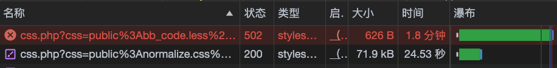
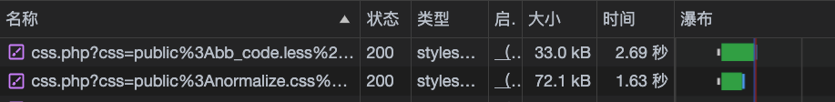

# XenforoLessCompiler

**[Chinese](README.md)**

XenforoLessCompiler is a local Less compiler that replaces Xenforo's lessphp to speed up the compilation of css to improve the overall speed of web pages.

## Use guide

```shell
git clone https://github.com/james18178/xf_less_compiler.git
cd xf_less_compiler
dart pub get
dart pub run bin/less_cgi
```
The default address is http://localhost:8080/
Make changes to the file in Xenforo /src/XF/CssRenderer.php

```php
class CssRenderer {
    ...
    protected function compliter_less($less_data){
        $apiUrl = 'http://localhost:8080';
        $tmp_file = tmpfile();
        fwrite($tmp_file,$less_data);
        $temp_path = stream_get_meta_data($tmp_file)['uri'];
        return $this->postDataFile($apiUrl,$temp_path);
        fclose($tmp_file);
    }
    
    protected function postDataFile($apiUrl, $filePath){
        $boundary = uniqid();
        $content = '';
        $content .= "--$boundary\r\n";
        $content .= "Content-Disposition: form-data; name=\"file\"; filename=\"" . basename($filePath) . "\"\r\n";
        $content .= "Content-Type: application/octet-stream\r\n\r\n";
        $content .= file_get_contents($filePath) . "\r\n";
        $content .= "--$boundary--";
        $options = array(
            'http' => array(
                'method' => 'POST',
                'header' => "Content-Type: multipart/form-data; boundary=$boundary\r\n",
                'content' => $content,
            ),
        );
        
        $context = stream_context_create($options);
        $response = file_get_contents($apiUrl, false, $context);
        return  $response;
    }
    ...
    ...
    public function parseLessColorValue($value)
	{
		$parser = $this->getFreshLessParser();

		$value = '@someVar: ' . $value . '; #test { color: @someVar; }';
		$value = $this->prepareLessForRendering($value);

		try
		{
        //  $css = $parser->parse($value)->getCss();
            $css = $this->compliter_less($value);
		}
		catch (\Exception $e)
		{
			return null;
		}

		preg_match('/color:\s*(#(?:[0-9a-f]{2}){2,4}|(#[0-9a-f]{3})|(rgb|hsl)a?\((-?\d+%?[,\s]+){2,3}\s*[\d\.]+%?\))/i', $css, $matches);

		if (!$matches || !isset($matches[1]))
		{
			return null;
		}

		return $matches[1];
	}
    ...
    ...
    protected function renderToCss($template, $output)
	{
		switch (strrchr($template, '.'))
		{
			case '.less':
				$parser = $this->getFreshLessParser();

				$output = $this->prepareLessForRendering($output);
				$output = $this->getLessPrepend() . $this->getLessPrependForPrefix($template) . $output;
				$renderContents = $output;
				try
				{
				 	// $output = $parser->parse($output)->getCss();
                    $output = $this->compliter_less($output);
                }
                catch (\Exception $e)
                {
                    return null;
                }
				break;

			default:
				$output = $this->prepareCssForRendering($output);
		}

		return $this->processRenderedCss($output);
	}
}
```

If you want to change the ip address/port number, do so in bin/less_cgi.dart

## Software effect display

** Environment Introduction: **
- Xenforo V2.2
- PHP V4.7
- NGINX
- Xenforo is disabled for CSS/LESS compiled data caching (code level)
- The client is directly connected to the server (other network impacts are ignored).


When not using the software


When using the software
